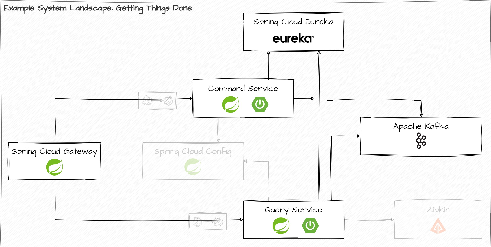

# Lab Assignment

Your task is to implement an Edge Service using the Spring Cloud Component _Spring Cloud Gateway_ and integrate this Edge Service with the existing services of our architecture. The resulting system should look like this:



## Task #1: Create a Spring Boot application for the Edge Service

1. Go to [start.spring.io](https://start.spring.io) and create a new Maven project using the following coordinates:

* Group ID: `workshop.spring.gateway`
* Artifact ID: `gtd-edge-service` (or choose your own)

2. What dependencies do you need to turn this Spring Boot application into a fully fledged Spring Cloud Gateway server? Add the necessary dependencies to the build.

3. Generate the Maven `pom.xml` using the Spring Initializr. Copy the resulting code into the local checkout of this repository and integrate it with the Maven build (cf. `<modules>` section of the parent POM).

4. Configure the Edge Service to listen on port `8080` (cf. `application.yaml`).

## Interlude: Configure Spring Boot Actuator

Spring Boot Actuator can give us insights on the current routing configuration of a running Edge Service instance. This is extremely helpful when developing and integrating new routes. So, in order to get more information via Actuator endpoints, execute the following steps:

1. Add the dependency on `org.springframework.boot:spring-boot-starter-actuator` (if you don't have it already).

2. Open up Actuator endpoints for local development. Reminder: Lock them down for production use!

```yaml
management:
  endpoint:
    health:
      show-details: "ALWAYS"
  endpoints:
    web:
      exposure:
        include: "*"
```

3. Explicitly set the configuration property `management.endpoint.gateway.enabled` to `true`.

The final configuration for Actuator endpoints should look like this:

```yaml
management:
  endpoint:
    gateway:
      enabled: true
    health:
      show-details: "ALWAYS"
  endpoints:
    web:
      exposure:
        include: "*"
```

4. Refine the default logging configuration. Add the following segment to `application.yaml`.

```yaml
logging:
  level:
    root: INFO
    org.springframework.cloud.gateway.route.RouteDefinitionRouteLocator: INFO
    org.springframework.cloud.gateway: TRACE
```

This will give us more detailed insights into the internal processing of Spring Cloud Gateway.

## Task #2: Routing HTTP requests to the Query Service

Note: Don't worry about integrating the Edge Service just yet. We'll work on `localhost` for this task.

Your task is to configure request routing via _predicates_ to the Query Service. We can differentiate between routing to the query and Command Service based on the HTTP method of the HTTP request.

1. Write a YAML-based route definition that delegates any HTTP GET requests to the Query Service (the Query Service listens on `localhost:8090`).
2. Verify that the route has been correctly configured by using the HTTP request definitions in `edge-service.http`.

## Task #3: Routing HTTP requests to the Command Service

Note: Don't worry about integrating the Edge Service just yet. We'll work on `localhost` for this task.

Your task is to configure request routing via _predicates_ to the Command Service. We can differentiate between routing to the query and Command Service based on the HTTP method of the HTTP request.

1. What is the difference between the following predicate configurations?

```yaml
spring:
  cloud:
    gateway:
      routes:
      -id: <route ID goes here>
        uri: <target URI goes here>
        predicates:
          - Method=POST
          - Method=PUT
          - Method=DELETE
```

and

```yaml
spring:
  cloud:
    gateway:
      routes:
      -id: <route ID goes here>
        uri: <target URI goes here>
        predicates:
          - Method=POST,PUT,DELETE
```

2. Write a YAML-based route definition that delegates any HTTP request that is either a HTTP POST, HTTP PUT, or HTTP DELETE to the Command Service (the Command Service listens on `localhost:8089`).

3. Verify that the route has been correctly configured by using the HTTP request definitions in `edge-service.http`.

## Task #4: Routing requests to OpenAPI UI

Note: Don't worry about integrating the Edge Service just yet. We'll work on `localhost` for this task.

Your task is to configure route definitions that target the OpenAPI UIs for both the Command Service and Query Service.

1. Based on the route definitions that you contributed as part of task 2 and task 3, answer the following question: What do you expect will happen if you open [http://localhost:8080/openapi/swagger-ui.html](http://localhost:8080/openapi/swagger-ui.html)? Why?

2. How would you address that problem?

3. Add another rule that matches all HTTP requests with path segment `/command-service` and that redirects these requests to path `/` of the Command Service.

4. Add another rule that matches all HTTP requests with path segment `/query-service` and that redirects these requests to path `/` of the Query Service.

5. What do you expect will happen if you open [http://localhost:8080/query-service/openapi/swagger-ui.html](http://localhost:8080/query-service/openapi/swagger-ui.html)? Why?

## Interlude: Dockerize the Edge Service

Before we can proceed and integrate the Edge Service with the Discovery Service, we need to include it into our Docker setup.

1. Add the following `Dockerfile` to the root of the Edge Service's Maven module.

```dockerfile
FROM eclipse-temurin:17.0.7_7-jre-jammy

WORKDIR /opt/app

RUN adduser --system -shell /usr/sbin/nologin --group javauser

COPY target/gtd-edge-service-1.0.0-SNAPSHOT.jar app.jar

RUN chown -R javauser:javauser .

USER javauser

ENTRYPOINT ["java", "-jar", "app.jar"]
```

2. Add the following line to `build-containers.{bat|sh}`:

```shell
docker build -t getting-things-done/gateway/edge-service ../gtd-edge-service
```

3. Add the following line to `docker-compose.yaml`:

```yaml
  edge-service:
    image: getting-things-done/gateway/edge-service
    build: ../gtd-edge-service/
    mem_limit: 256m
    ports:
      - "127.0.0.1:8080:8080"
    links:
      - discovery-service
      - command-service
      - query-service
    environment:
      EUREKA_CLIENT_SERVICEURL_DEFAULTZONE: http://discovery-service:8761/eureka/
```

## Task #5: Integrate the Edge Service with the Discovery Service

1. Configure the Edge Service such that it is able to register itself with the Eureka server. If you're unsure how to do this, refer to the configuration that you've done in the previous lab assignment.

2. How does the Edge Service target an application instance? (if you're unsure, revisit the slides on _Integrating an Eureka client_ from the session _Service Discovery with Eureka_).

3. The Edge Service should be able to perform _client-side load-balancing_. Which bean do you need to provide in order to enable client-side load balancing?

4. What needs to change wrt. the route definitions to use the Discovery Service instead of routing requests to individual instances?

5. Change the route definitions to comply with this.

## (Optional) Task #6: Routing requests to Eureka server

The Eureka server exposes both an API and a web page for its clients. We'll provide routing rules so that this distinction stays clear at the level of the Edge Service.

Assume that the target URI of the Eureka server is at `http://${app.eureka-server}:8761`.

1. Define a routing rule called `eureka-api` that matches the path `/eureka/api/{segment}` and use the `SetPath`-filter to rewrite the target path to `/eureka/{segment}`.

2. Define a routing rule called `eureka-web-start` that matches the path `/eureka/web` and use the `SetPath`-filter to rewrite the target path to `/`.

3. Define a routing rule called `eureka-web-other` that matches on all other web-related requests to Eureka server and that passes them on as is.

## That's it! You've done great!

You have completed all assignments. If you have any further questions or need clarification, please don't hesitate to reach out to us. We're here to help.