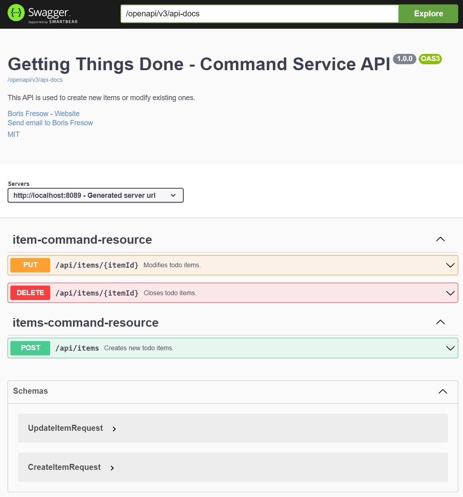

# Spring Workshop - Spring Cloud Gateway - Lab

This repository includes the lab assignment on implementing an edge service using Spring Cloud Gateway.

## Getting Started

After introducing a discovery service into our system landscape and integrating it with our application services, we're now ready to move on to the next step. We'll extend our system landscape by adding another service that will act as a single, unified gateway to all of our application services and infrastructure components. Before we start though, we have to make sure that the baseline for this lab assignment builds and packages correctly into Docker images that we are able to run locally.

### Building source code

The source material that we're working on comprises several Maven modules. Please make sure that everything compiles successfully. You'll find the top-level `pom.xml` at the root folder of the lab content. Issue a

```bash
$ mvn clean package
```

from within the root folder. This builds all the modules; the fat JARs for every module will be located at the `target` folder for each and every Maven module. Building the Docker images for our services relies on these JAR files, so make sure that you build the whole solution first before building the Docker images.

### Building Docker images

The source material that you're given features a `docker` folder. You'll find all the scripts for the assignment in that folder. To make sure that you've got all the required Docker images present on your system, we recommend that you start up the baseline scenario. This can be done by issuing

*Linux / MacOS*

```bash
$ cd docker
$ ./build-containers.sh
$ docker-compose up
```

*Windows*

```bash
$ cd docker
$ build-containers.bat
$ docker-compose up
```

This will launch a service instance of the command service and the query service, which both expose a public HTTP API that you work with. It also launches a small Kafka cluster consisting of a single broker. This is a requirement for the interoperability between the command service and the query service. Don't worry too much about that Kafka cluster - it needs to be there, but we won't work with it.

Please make sure that both services launch correctly and respond with their public API.

* The command service listens on port `8089`.
* The discovery service listens on port `8090`.
* The discovery service listens on port `8761`.

All of these services expose their port through the host system and are thus available via `localhost`.

* Click [here](http://localhost:8089/openapi/swagger-ui.html) for opening the OpenAPI UI for the command service.
* Click [here](http://localhost:8090/openapi/swagger-ui.html) for opening the OpenAPI UI for the discovery service.
* Click [here](http://localhost:8761/eureka) for opening the dashboard of the Eureka Server



The API specification is minimalistic. Nevertheless, play around with the OpenAPI UI a bit to get a feel for what we'll be working on as part of the workshop.

If you have any questions or run into problems, please don't hesitate to ask for help.

### Docker CLI Hints

*Starting containers using `docker-compose`*

```bash
$ docker-compose up
```

*Stopping containers using `docker-compose`*

```bash
$ docker-compose stop
```

*Removing containers using `docker-compose`*

```bash
$ docker-compose rm -f
```
